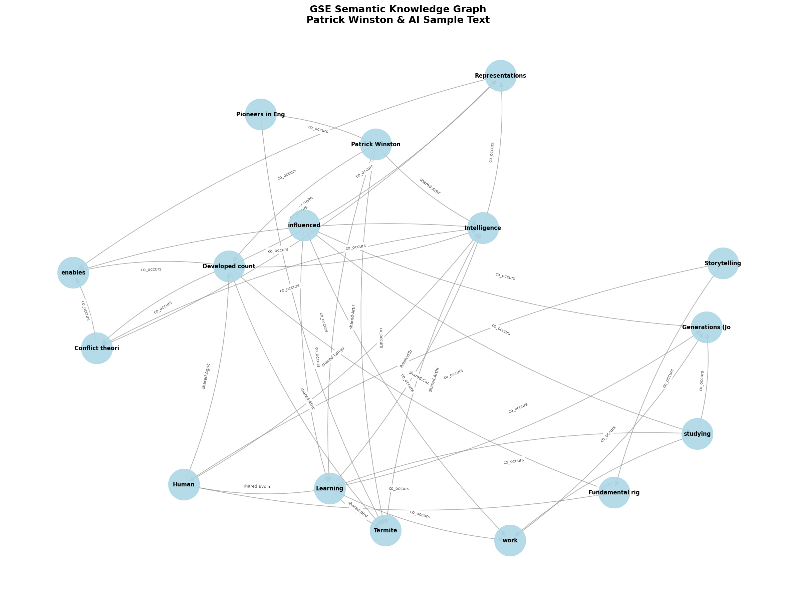

# GSE Semantic Knowledge Graph

Extract knowledge graphs from text using **Grounded Semantic Encoding (GSE)** — interpretable, Wikipedia-grounded, and fast.


*Semantic graph extracted from text about cognition, storytelling, and ADHD. Node size = mention frequency, colors = EPA affect values.*

## What Makes GSE Different

| Approach | Limitation |
|----------|------------|
| **Dependency Parsing** (spaCy) | Captures grammar, not meaning. "Bank" treated same in "river bank" vs "savings bank" |
| **Embeddings** (TransE) | Opaque similarity scores. Can't explain *why* concepts relate |
| **LLM Extraction** (GPT) | Expensive, slow, hallucinates, no grounding |

**GSE approach:**
- **Position IS meaning** — 8192-dim sparse ternary vectors where each dimension = semantic primitive
- **Wikipedia grounding** — Concepts linked to entities with multi-dimensional positions
- **Interpretable** — Every relationship traceable: "Einstein → Physics via SCOPE anchor, → 20th century via TEMPORAL dimension"

## Installation

```bash
git clone https://github.com/rohanvinaik/semantic_knowledge_graph.git
cd semantic_knowledge_graph
pip install -e .
```

## Quick Start

```python
from gse_graph import encode_text, extract_graph, resolve_entities

text = """
Einstein discovered relativity. His work transformed physics
and our understanding of space and time.
"""

# Encode → Extract → Resolve
encodings = encode_text(text)
graph = extract_graph(encodings, text)
graph = resolve_entities(graph)

# Export for visualization
output = graph.to_json()
```

## Cassette System

Swap extraction strategies based on your needs:

```
Text → encode_text() → TokenEncodings
                            ↓
              ┌─────────────┴─────────────┐
              ↓                           ↓
      ┌──────────────┐            ┌──────────────┐
      │   Grammar    │            │   Semantic   │
      │   Cassette   │            │   Cassette   │
      │              │            │              │
      │ • SVO edges  │            │ • Wiki link  │
      │ • Co-occur   │            │ • Spreading  │
      │ • Fast ~1ms  │            │   activation │
      └──────────────┘            │ • Anchors    │
                                  │ • Rich ~500ms│
                                  └──────────────┘
                            ↓
                    SemanticGraph
                 (nodes, edges, 3D viz)
```

```python
# Fast structural analysis
graph = extract_graph(encodings, text, cassette="grammar")

# Rich semantic grounding (default)
graph = extract_graph(encodings, text, cassette="semantic")
```

## Output Format

```python
graph.to_json()
# Returns:
{
    "nodes": [
        {
            "id": "Q_Einstein",
            "label": "Albert Einstein",
            "x": 12.5, "y": -3.2, "z": 8.1,
            "color": "rgb(200,180,220)",
            "banks": {"MENTAL": 0.4, "TEMPORAL": 0.3},
            "mentions": 2
        }
    ],
    "edges": [
        {
            "source": "Q_Einstein",
            "target": "Q_Physics",
            "label": "shared:Relativity",
            "type": "MENTAL",
            "weight": 0.49
        }
    ]
}
```

## Visualization

Output designed for [3d-force-graph](https://github.com/vasturiano/3d-force-graph):

```javascript
import ForceGraph3D from '3d-force-graph';

ForceGraph3D()(document.getElementById('container'))
    .graphData(gseOutput)
    .nodeColor(n => n.color)
    .nodeVal(n => n.mentions);
```

See `visualization_borges.html` for a live interactive example.

## Semantic Banks

| Bank | Detects | Examples |
|------|---------|----------|
| SUBSTANTIVES | Entities | people, objects, places |
| ACTION | Processes | create, move, transform |
| MENTAL | Cognition | think, believe, understand |
| TEMPORAL | Time | before, after, during |
| SPATIAL | Location | above, inside, near |
| LOGICAL | Causation | because, therefore |
| EVALUATORS | Judgment | good, important |

## License

MIT
